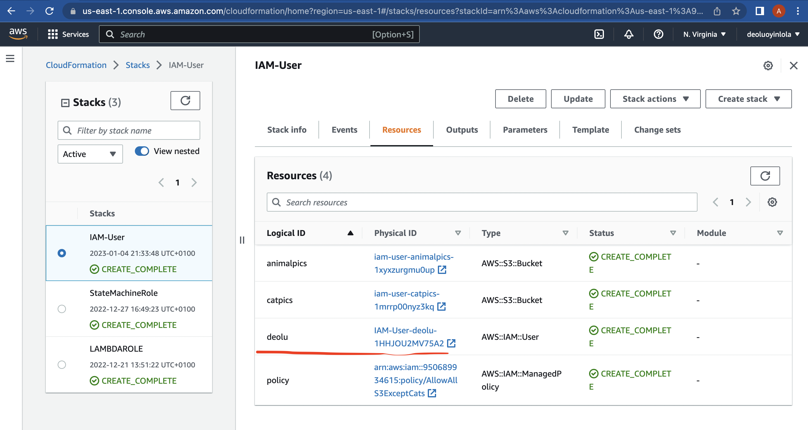
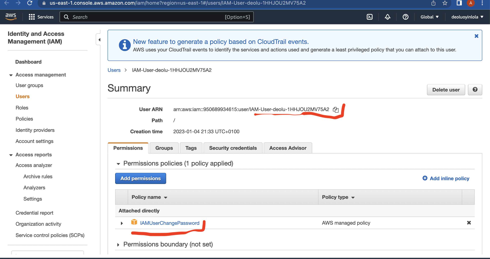

In this DEMO lesson I create an IAM user, and experiment with assigning permissions on two S3 buckets via inline policies and managed policies.

The DEMO lesson will require two browsers
- the 1st will login to the IAMADMIN user of the general account
- the 2nd will login to an IAM user called 'deolu' for testing.

- I will not set any particular hard-coded name in the cfn, so it will automatically generate resources name.

- Open up deolu user, under resource, leading to IAM console. Discover it is aws managed policy

From here, > Dashboard > copy the, Sign-in URL for IAM users in this account, from the right hand > In another browser, paste the link https://950689934615.signin.aws.amazon.com/console