!Note that all the files, images and architecture reference are find inside IAM-permission dir of Docs dir.;

https://www.linkedin.com/pulse/best-security-practises-setting-up-aws-account-mark-smoktunowicz/?trackingId=Vp2pNOZd3tqDvT6YSWHYvg%3D%3D

In this DEMO lesson;
* [Goals](#goals)
* [IAM User](#IAM-User)
* [IAM Group](#IAM-Group)

## Goals
I create an IAM user, group and experiment with assigning permissions on two S3 buckets via inline policies and managed policies.

## IAM User
The DEMO lesson will require two browsers
- the 1st will login to the IAMADMIN user of the general account
- the 2nd will login to an IAM user called 'deolu' for testing.

### Upload Image to S3 Bucket
- I will not set any particular hard-coded name in the cfn, so it will automatically generate resources name.
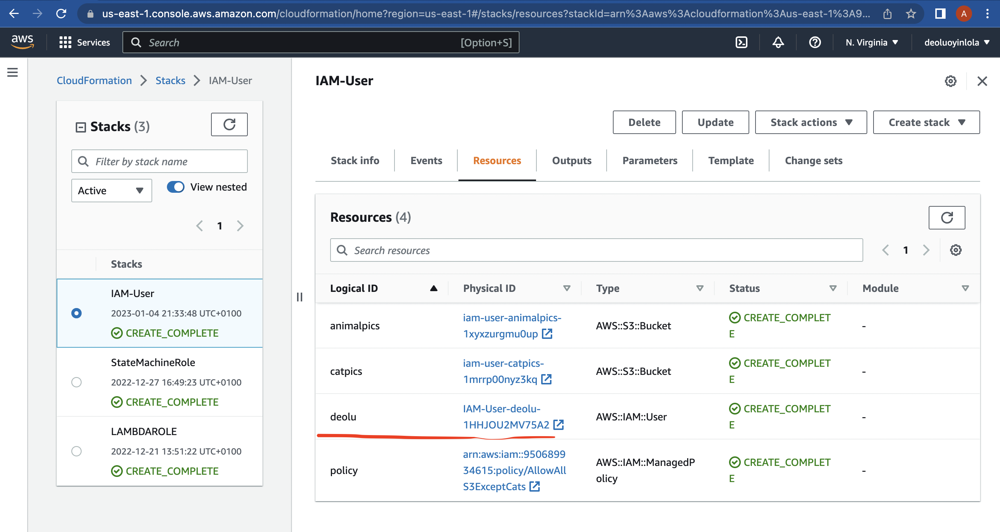

- Open up deolu user, under resource, leading to IAM console. Discover it is aws managed policy
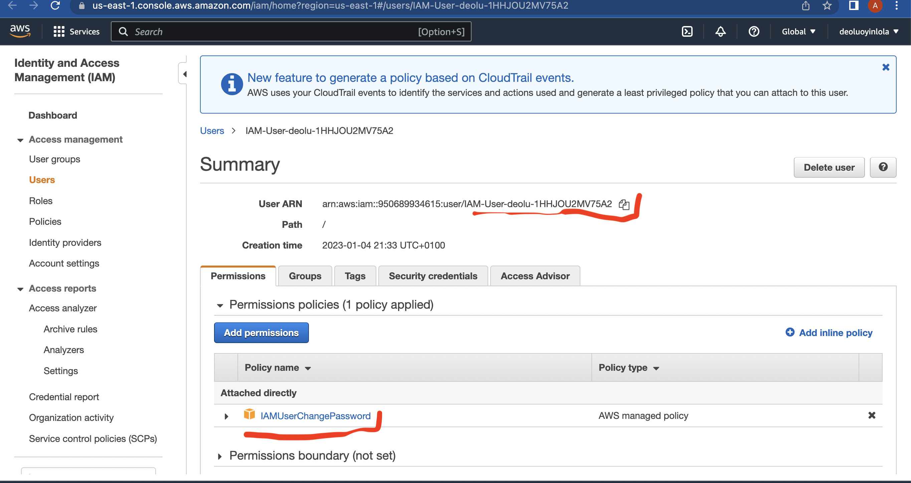

From here, > Dashboard > copy the, Sign-in URL for IAM users in this account, from the right hand > In another browser, paste the link https://950689934615.signin.aws.amazon.com/console

Move to s3 bucket console in the 'iam-animal' to upload the pic;
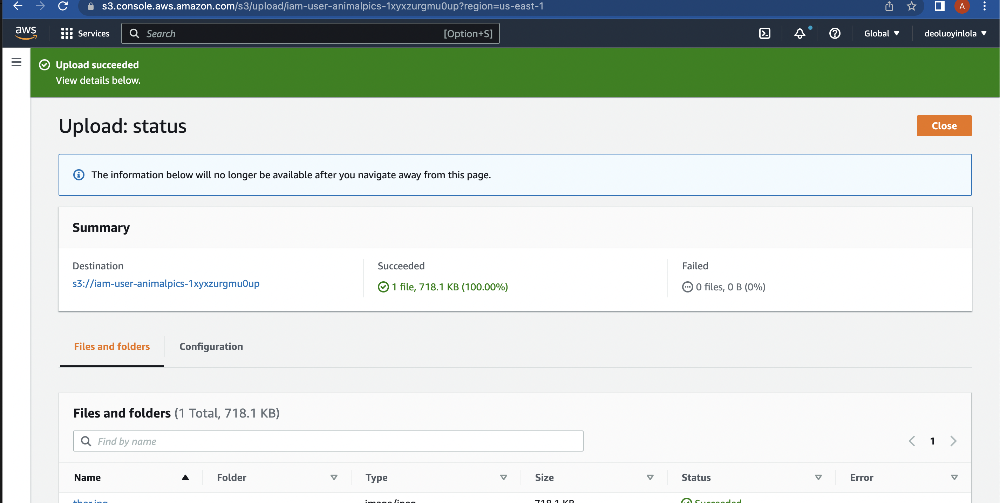

Repeat same process for iam-cat;
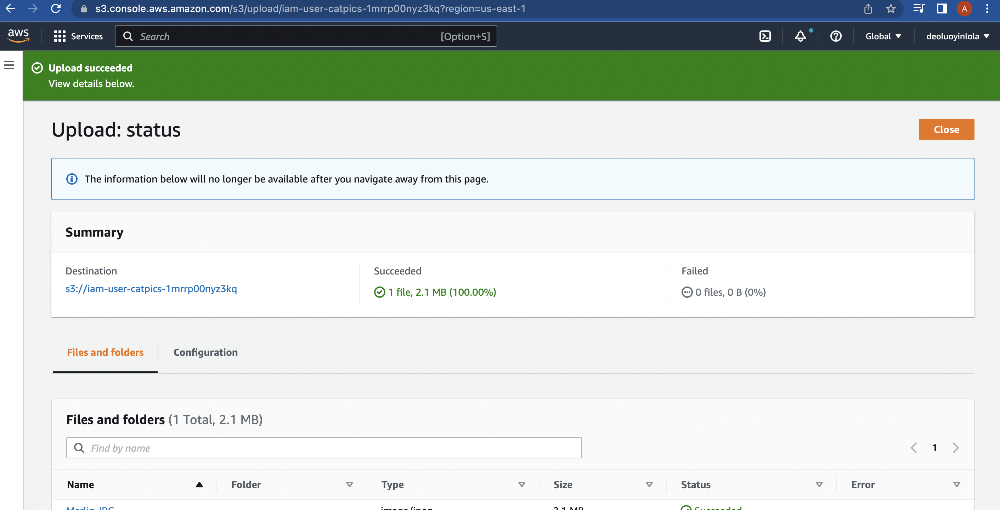

### Set and Change Permission
From IAM console; User >  IAM-User-deolu-... > Add Permissions > Attach existing policies directly > AllowAllS3ExceptCats > Next; Review > Add Permissions

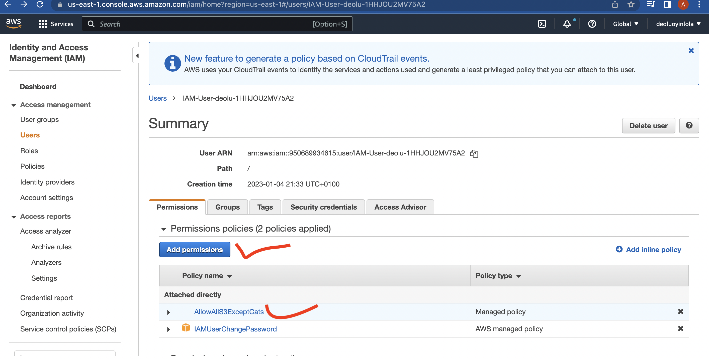

## IAM Group
How groups can be used to hold permissions for group members.
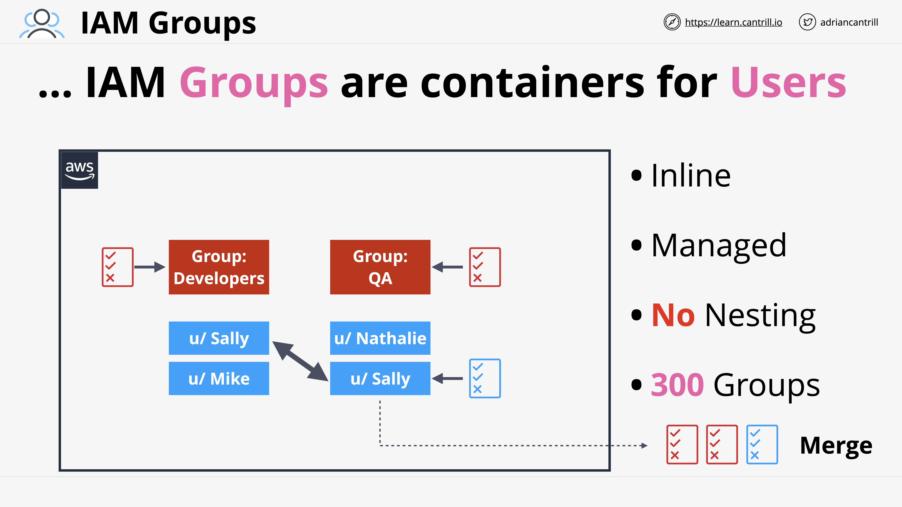

From the admin IAM User account and N. Virginia region;
Enter Cloudformation console;
- Create stack > Template is ready > Upload file > (select the right file, which define the stack, I used demo_cfn.yaml) > Enter stack name and password > Next > Acknowledge > Submit
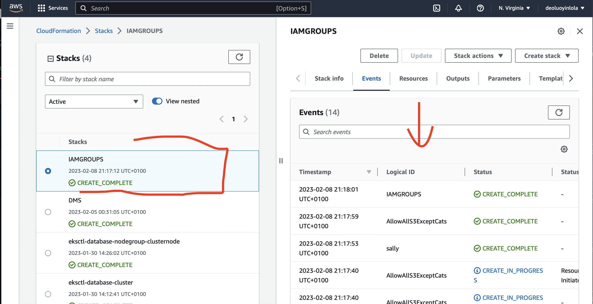

- In the service box, type S3 and click the console > catpics bucket > click upload > (Upload the right images). Once is uploaded, back to the s3 console and repeat same for animalpics bucket. 
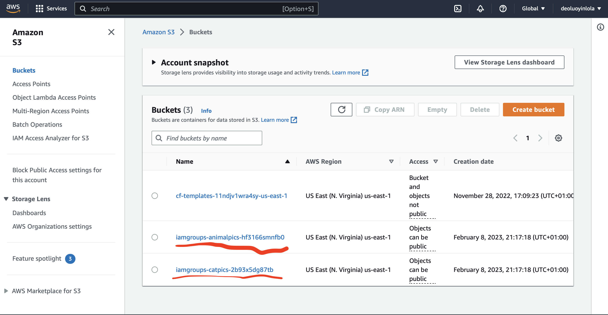

- Back to the cloudformation > click Resource > click Sally > Add Permission > Attach existing policies directly > Select "AllowAllS3.." > Next > Add Permission
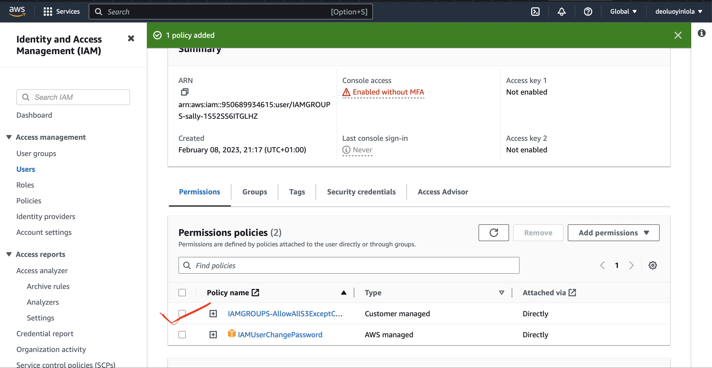

- Click Dashboard from IAM console > copy the Sign-In url for IAM User, paste on a separate browser > For login detail, back to cloudformation and click on output to copy the username, then put the password supplied while creating the stack
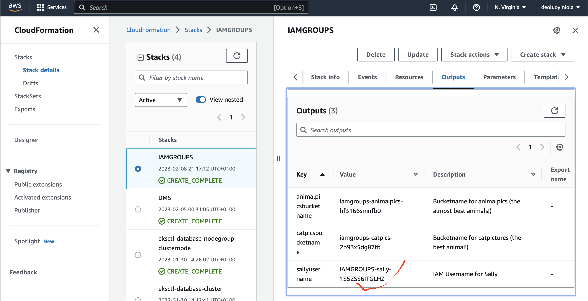

- Move over to the s3 console to verify if sally user have access to both bucket. Easiest way is to open both of these images uploaded. While sally have access to animalpic bucket but not to catpic as intended.
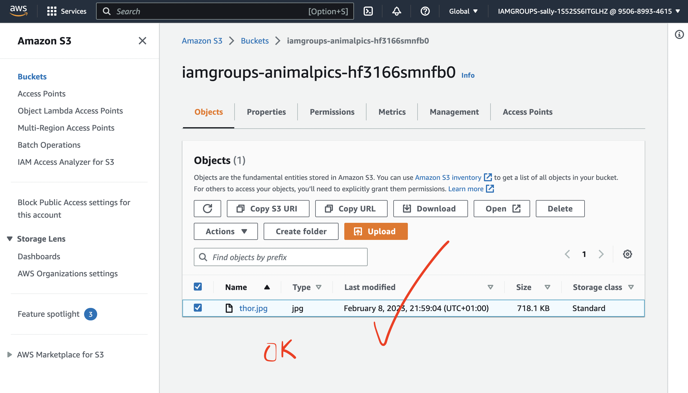
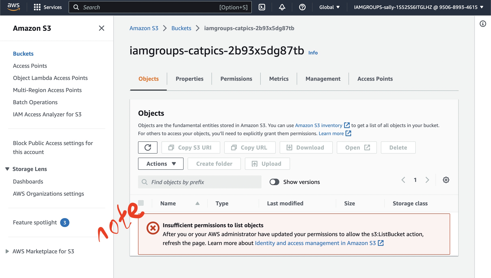

- Access modification for group rather than just user. Move to cloudformation of the stack > click Resource > select Sally > Remove managed policy from Sally. With this, Sally wouldn't have any permission on either of the bucket again.
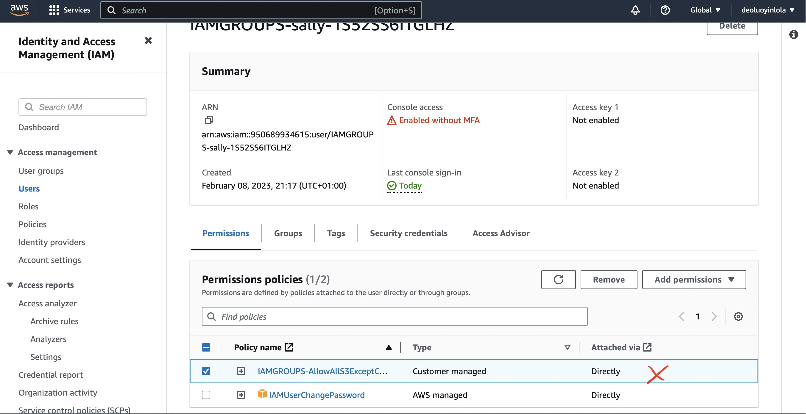

- Click user group from IAM console > create group > name the group "developer" > select/attach the same policy Sally had previously "IAMGroup-AllowAll..." > create group. Have successfully created developer group.
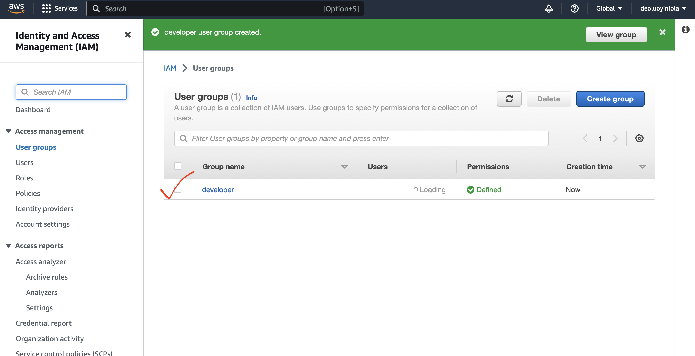

- Can add more users to the group > from the user group > click user > click add user > select the group, here "IAMGROUPS-sally..." click add user. Now IAM User in now member of IAM developer group. And IAM developer group policy has be attached to animalpic bucket.
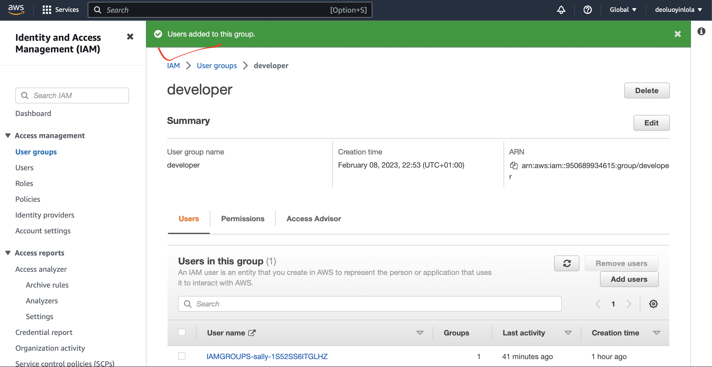

- Verify access to the group. Move to the sally user browser, should now get access to animalpic
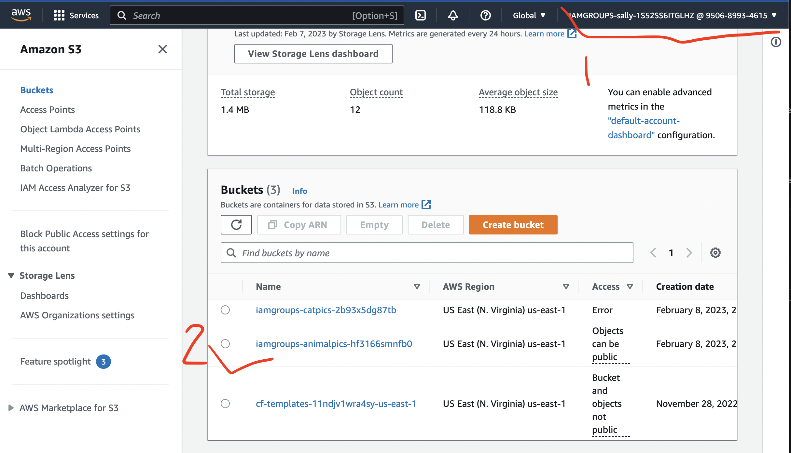

## Tidy up the accounts!!!
- Distach the user group
- Delete the group
- as the iamadmin user, open the s3 console and empty boths buckets
- select the cloudformation stack, hit delete