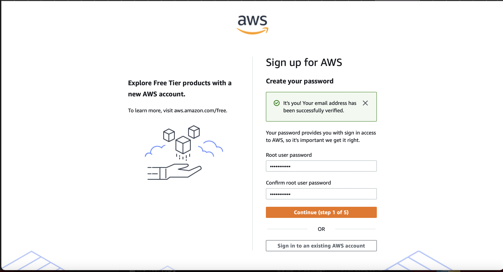

In this DEMO lesson;
* [Goals](#goals)
* [AWS Account](#AWS-Account)

## Goals
This lesson demonstrates how to create an AWS account.

## AWS Account
- Requirement; Email address for the root user of this account and AWS account name.
- Sign up through AWS registration portal; https://portal.aws.amazon.com/billing/signup#/start
- Fill in the details, verify email
- Choose a suitable strong password
- Choose and fill all the appropriate boxes
- In my case, I use PROD-account for the account

