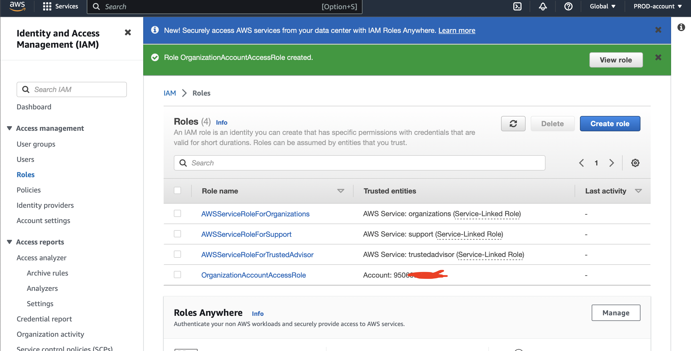

!Note that all the files, images and architecture reference are find inside IAM-permission dir of Docs dir.;

In this DEMO lesson;
* [Goals](#goals)
* [AWS Organisation](#AWS-Organisation)
* [Role Switch](#Role-Switch)
* [Service Control Policies](#Service-Control-Policies)

## Goals
In this hands-on I will create an aws organisation for a business. The GENERAL account will become the MASTER account for the organisation.
I will invite the PROD account as a MEMBER account and create the DEV account as a MEMBER account.

I will also create an OrganizationAccountAccessRole in the production account, and use this role to switch between accounts.

## AWS Organisation
AWS Organizations - It's architecture and some of the benefits for businesses managing larger numbers of AWS Accounts in a cost effective way.

AWS Standard Account is account which is not within an organisation, which becomes the management account(master) for the organisation. With this account, you can invite exist standard account which they all now becomes part of AWS organisation. And at joining, they change from standard to member account of that organisation. So, organisation have 1 master account and 0 or more member accounts.
- Requirement; Other additional AWS accounts say for Production and Develop account, the email address used to create root user of production account, Set up additional browser.

### With Existing AWS Account option - for PROD-Account
- Login into the General AWS account, select N. Virginia region
- Process of converting General/standard account to management account of the organization;
From the find service box, type `AWS organization` click on `Create an Organization` 

- Invite production account;
From the just created AWS Organization, click `Add an AWS Account` > select `Invite an Existing AWS cccount` > Supply either the account email address or ID > Click `Send Invitation`

- Accept the invitation;
Move and sign into the other account - Production account. From the find service box, type `AWS organization` Click on `Invitation` > Click on `Accept Invitation`. One can confirm acceptance from the management account, by moving back tot the management acount and refresh.

### With Create an Account option - for DEV-Account
- Login into the General AWS account, select N. Virginia region.
From the find service box, type `AWS organization` click on `Add an AWS Account` > click `Create an Account` > Supply appropriate AWS account name, email, IAM role name - OrganizationAccountAccessRole(default) > click `Create AWS Account`

- Invite production account;
From the just created AWS Organization, click `Add an AWS Account` > select `Invite an Existing AWS cccount` > Supply either the account email address or ID > Click `Send Invitation`

## Role Switch
- Only apply to invited account(if the account created within the AWS organization, role will be created automatically).
From the production account, in the find service box, type `IAM` > From IAM console, click `Roles` > click `Create Role` > choose `AWS Account` > Supply the `Management Account ID` > click `NEXT`. In the next page select  `AdministratorAccess` > click `Next` > in the next screen supply `OrganizationAccountAccessRole` as role name been the AWS standard > Click `Create Role`. After creation, select the role

### Switching
- How to switch this role from general account to production account.
Back to the general account(will only work with IAM User). From the default page of this account, under the account dropdown, Select `Switch Role` > Supply appropriate Account ID, Role(same as created above - OrganizationAccountAccessRole), Display Name and Colour. Can also switch back, by selecting from option under the account dropdown.

## Service Control Policies