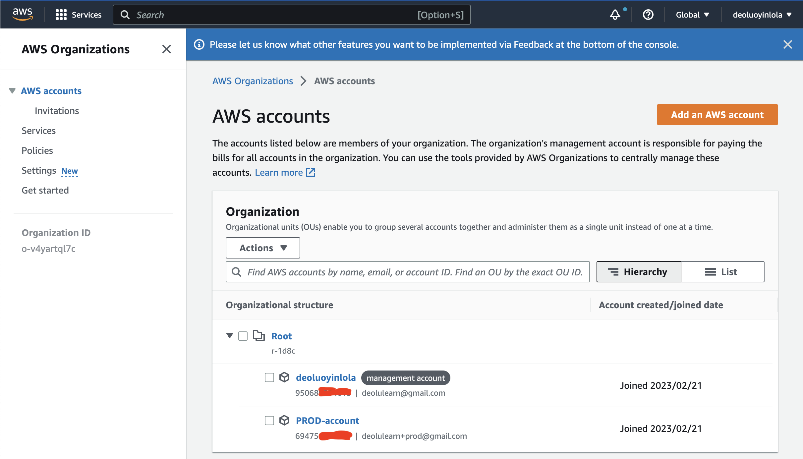

!Note that all the files, images and architecture reference are find inside IAM-permission dir of Docs dir.;

In this DEMO lesson;
* [Goals](#goals)
* [AWS Organisation](#AWS-Organisation)
* [Service Control Policies](#Service-Control-Policies)

## Goals
In this hands-on I will create an aws organisation for a business. The GENERAL account will become the MASTER account for the organisation.
I will invite the PROD account as a MEMBER account and create the DEV account as a MEMBER account.

Finally - I will create an OrganizationAccountAccessRole in the production account, and use this role to switch between accounts.

## AWS Organisation
- Requirement; Other additional AWS accounts say for Production and Develop account, the email address used to create root user of production account, Set up additional browser.
- Login into the General AWS account, select N. Virginia region
- Convert General/standard account to management account of the organization;
From the find service box, type `AWS organization` click on `Create an Organization` 

- Invite production account;
From the just created AWS Organization, click `Add an AWS Account` > select `Invite an Existing AWS cccount` > Supply either the account email address or ID > Click `Send Invitation`

- Accept the invitation;
Move and sign into the other account - Production account. From the find service box, type `AWS organization` Click on `Invitation` > Click on `Accept Invitation`. One can confirm acceptance from the management account, by moving back tot the management acount and refresh.

## Service Control Policies