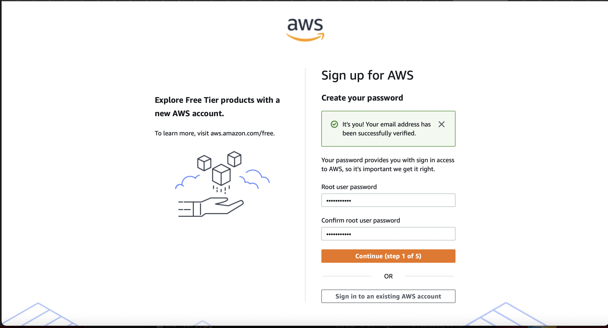
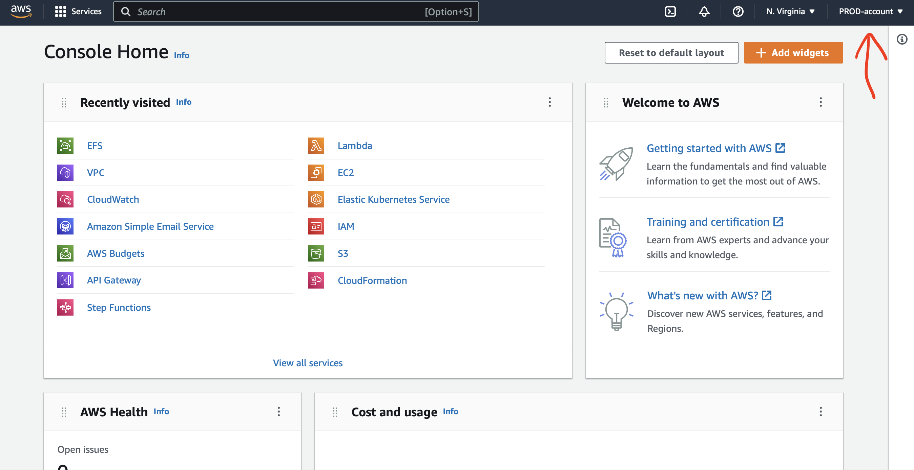

In this DEMO lesson;
* [Goals](#goals)
* [AWS Account](#AWS-Account)

## Goals
This lesson demonstrates how to create an AWS account.

## AWS Account
- Requirement; Email address for the root user of this account and AWS account name.
- Sign up through AWS registration portal; https://portal.aws.amazon.com/billing/signup#/start
- Fill in the details, verify email
- Choose a suitable strong password
- Choose and fill all the appropriate boxes
- In my case, I use PROD-account for the account

## Access Key (limit of 2 per user)
- How to create access key from the management console.
- For Admin/root user, as the admin user of the said account, under account dropdown select `My Security Credential` > click `Create Access Key` > Copy the Access Key ID and Secret Access Key - Download .csv file
- For other user, Sign in to the AWS Management Console and open the IAM console at https://console.aws.amazon.com/iam/ . In the navigation pane, choose Users. Choose the name of the intended user, and then choose the Security credentials tab. In the Access keys section, choose Create access key.

## AWS CLI Installation and configure
- https://docs.aws.amazon.com/cli/latest/userguide/getting-started-install.html

- How do I quickly check my AWS credentials?

A - “aws sts get-caller-identity” 
B - “aws s3 ls”

A or B?