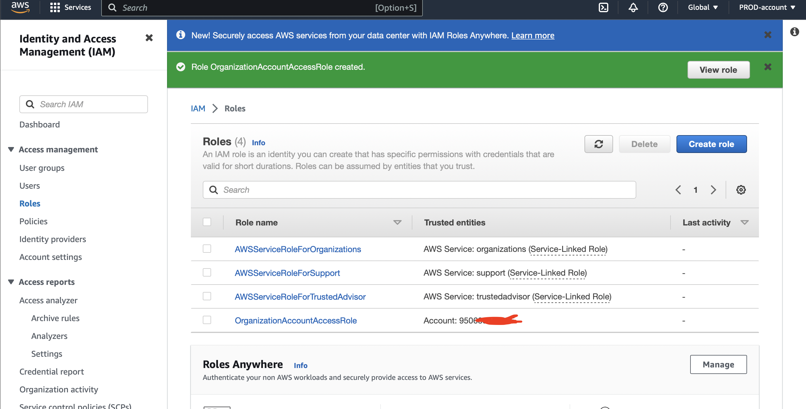

!Note that all the files, images and architecture reference are find inside IAM-permission dir of Docs dir.;

In this DEMO lesson;
* [Goals](#goals)
* [AWS Organisation](#AWS-Organisation)
* [Role Switch](#Role-Switch)
* [Service Control Policies](#Service-Control-Policies)
* [Org. CloudTrail](#Org.-CloudTrail)

## Goals
In this hands-on I will create an aws organisation for a business. The GENERAL account will become the MASTER account for the organisation.
I will invite the PROD account as a MEMBER account and create the DEV account as a MEMBER account.

I will also create an OrganizationAccountAccessRole in the production account, and use this role to switch between accounts.

## AWS Organisation
AWS Organizations - It's architecture and some of the benefits for businesses managing larger numbers of AWS Accounts in a cost effective way.

AWS Standard Account is account which is not within an organisation, which becomes the management account(master) for the organisation. With this account, you can invite exist standard account which they all now becomes part of AWS organisation. And at joining, they change from standard to member account of that organisation. So, organisation have 1 master account and 0 or more member accounts.
- Requirement; Other additional AWS accounts say for Production and Develop account, the email address used to create root user of production account, Set up additional browser.

### With Existing AWS Account option - for PROD-Account
- Login into the General AWS account, select N. Virginia region
- Process of converting General/standard account to management account of the organization;
From the find service box, type `AWS organization` click on `Create an Organization` 

- Invite production account;
From the just created AWS Organization, click `Add an AWS Account` > select `Invite an Existing AWS cccount` > Supply either the account email address or ID > Click `Send Invitation`

- Accept the invitation;
Move and sign into the other account - Production account. From the find service box, type `AWS organization` Click on `Invitation` > Click on `Accept Invitation`. One can confirm acceptance from the management account, by moving back tot the management acount and refresh.

### With Create an Account option - for DEV-Account
- Login into the General AWS account, select N. Virginia region.
From the find service box, type `AWS organization` click on `Add an AWS Account` > click `Create an Account` > Supply appropriate AWS account name, email, IAM role name - OrganizationAccountAccessRole(default) > click `Create AWS Account`

## Role Switch
- Only apply to invited account(if the account created within the AWS organization, role will be created automatically).
From the production account, in the find service box, type `IAM` > From IAM console, click `Roles` > click `Create Role` > choose `AWS Account` > Supply the `Management Account ID` > click `NEXT`. In the next page select  `AdministratorAccess` > click `Next` > in the next screen supply `OrganizationAccountAccessRole` as role name been the AWS standard > Click `Create Role`. After creation, select the role

### Switching
- How to switch this role from general account to production account.
Back to the general account(will only work with IAM User). From the default page of this account, under the account dropdown, Select `Switch Role` > Supply appropriate Account ID, Role(same as created above - OrganizationAccountAccessRole), Display Name and Colour. Can also switch back, by selecting from option under the account dropdown.

## Service Control Policies
- A feature of AWS Organizations which allow restrictions to be placed on MEMBER accounts in the form of boundaries.
Management account is special and the only unrestricted account in the AWS organisation. Not affected by any SCP.
- SCPs DON'T GIVE permission - they just control what an account CAN and CANNOT grant via identity policies. 
Is a policy document. JSON document attached to organisation root container or 1 or 2 of the OU

- Creating Organizational Unit - PROD Organizational Unit. 
Login into the Management account, select N. Virginia region.
From the find service box, type `AWS organization` click `AWS Account` > Select the `Root` of the Organizational Structure > Then click `Actions` dropdown and choose `Create New` > Name it with `PROD` > Click `Create Organizational Unit`

- Move Account to relevant Organizational Unit 
Select the account, here `PROD-Account` > click `Actions` dropdown and choose `Move` > In the next dialog, select the right OU - PROD > Click `Move AWS Account`

### Creating and consuming SCP 
- From AWS Organization console, Select `Policies` > click `Service Control Policies` > Click `Enable Service Control Policies`. From here, one can then decide to use the default `FullAWSAccess` or add and enable another policy writing in JSON document.
To create another policy, move to the policies section of AWS Organization console. Then click on `Create Policy` > Name the policy and edit the statement as desire > click on `Create Policy`.
- To use it, in the AWS Organization, click on `AWS Accounts` > click on the desire OU - here, PROD > Click on `Policy` > click `Attach` > Select the appropriate policy, then click `Attach Policy`. 

## Org. CloudTrail
- This CloudTrail will be configured for all regions and set to log global services events. I will set the trail to log to an S3 bucket and then enhance it to inject data into CloudWatch Logs.

Login into the Management account(can as well be done inside the individual account, but more effeciency to use Organizational Trail), select N. Virginia region. From the find service box, type `cloudtrail` > click the hamburger menu > click `trails` > click `create trail` > Supply name - `Animals4lifeORG`, enable for all accounts, other options add some layer of security esp. for production usage, enable cloudwatch log, create new IAM Role, name - `CloudTrailRoleForCloudWatchLogs_Animals4Life` > click `Next`. Next page, where to select event type; choose the default - `Management Events` and API activity of `Read & Write` > click on `Next` > Review and Confirm everything that it looks good > click `Create Trail`

- Inspect the content inside the S3 bucket. Open the S3 bucket in another browser, From the folder structure, open the CloudTrail folder > Then keep going down till where one can open the JSON file either by download it or through the browser, and do some level of findings from the relevant information in the file.

View Event History to search for particular event e.g who log into what? what IAM user been doing with a particular account etc; From the cloudtrail console > click the hamburger menu icon > Click `Event History` > 

Because, CloudWatch Log is enabled to receive the log, one can view that as well. From the find service box, type `cloudwatch` > Log > click `log groups` > click the log group that was just created

Inside it contain all the log stream which will start with the unique organizational code(1. management and PROD) where one can further

## Clean up the cloudtrail
Cloudtrail generate large number of request data into S3, So to avoid unnecesary billing; Move to trails > Select the actual trail > click on `Stop logging` and can later start logging if desire.
