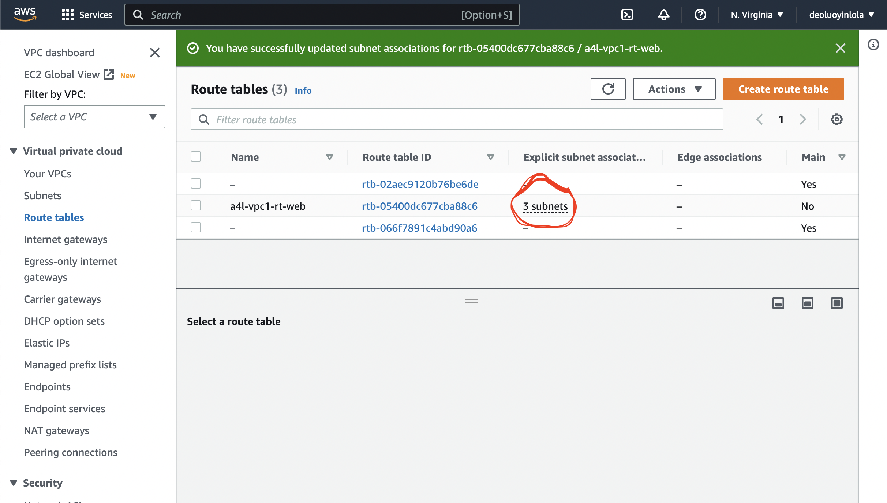

!Note that all the files, images and architecture reference are find inside vpc dir of Docs dir.;


In this DEMO lesson;
* [Goals](#goals)
* [References](#References)
* [Create VPC](#Create-VPC)
* [VPC Subnet](#VPC-Subnet)
* [Internet Gateway](#Internet-Gateway)
* [Route Table](#Route-Table)
* [Create Bastion](#Create-Bastion)
* [VPC Gateway Endpoint](#VPC-Gateway-Endpoint)
* [VPC Interface Endpoint](#VPC-Interface-Endpoint)
* [Egress-Only Internet Gateway](#Egress-Only-Internet-Gateway)

## Goals
In this hands-on I will create an aws VPC for a business, with VPC Subnet, Internet Gateway, Route Tables and Routes. Once the WEB subnets are public, we create a bastion host with public IPv4 addressing and connect to it to test.


## References
[AWS-VPC-Option](https://d1.awsstatic.com/whitepapers/aws-amazon-vpc-connectivity-options.pdf)

- VPC Capacity Formulation Plan Example; 1.)Number of AWS regions the business will operate in., 2.)How many AZs(for resilient) will the VPC use(say at least 3) & tiers - subnet, 3.) e.g 16/ VPC - 4AZs, 4tiers - 16 subnets. Where 16 subnets = /20 per subnet(4091IPs)


## Create VPC
- Login into the Management AWS account, select N. Virginia region
- From the find service box, type `VPC` to move to vpc console, click on `Your VPCs` Click on `Create VPC` Decide and choose which resource to create from `VPC Settings`, here - VPC only, then give it a name; a4l-vpc1, set the IP range - CIDR, Select `Amazon-provided...` for IPv6 CIDR block so that it will be enable for IPv6. Maintain the tenancy at default or if desire can change but factor cost. Every other thing remain default. > Click `Create VPC`

- From the just created VPC, Select `Action` dropdown > Choose `Edit VPC Setting` > Enable all setting under `DNS setting` > Click on `Save`

## VPC Subnet
- Use the calculator below to get the appropriate IP addresses
[Subnet Calculator](https://www.site24x7.com/tools/ipv4-subnetcalculator.html)
- For convience, here are the IP addresses;
```
NAME CIDR AZ CustomIPv6Value

sn-reserved-A 10.16.0.0/20 AZA IPv6 00
sn-db-A 10.16.16.0/20 AZA IPv6 01
sn-app-A 10.16.32.0/20 AZA IPv6 02
sn-web-A 10.16.48.0/20 AZA IPv6 03

sn-reserved-B 10.16.64.0/20 AZB IPv6 04
sn-db-B 10.16.80.0/20 AZB IPv6 05
sn-app-B 10.16.96.0/20 AZB IPv6 06
sn-web-B 10.16.112.0/20 AZB IPv6 07

sn-reserved-C 10.16.128.0/20 AZC IPv6 08
sn-db-C 10.16.144.0/20 AZC IPv6 09
sn-app-C 10.16.160.0/20 AZC IPv6 0A
sn-web-C 10.16.176.0/20 AZC IPv6 0B

Remember to enable auto assign ipv6 on every subnet you create.
```
- From the VPC, select `Subnets` > click `Create Subnet` > Choose the right VPC ID from the dropdown > Populate and add more 3 subnet in the Subnet Settings > Click `Create Subnet`. Repeat the above steps for the next subnet - AZ-b, repeat one more time for the last subnet - AZ-c with the above info for each subnet creations.


### Manually Set auto assign ipv6
Select each subnet and click on > Click on `Action` > Choose `Edit Subnet Setting` > Check `Enable auto-assign ipv6 address` > click on `Save`. Repeat the same process for other 11 subnets.

## Internet Gateway
- From the find service box, type `VPC` to move to vpc console, click on `Subnets`
- Configure the web tiers into public subnet; 
(1.) Attach IGW to VPC, So click on `Internet Gateway` > Click on `Create Internet Gateway` > name it as `a4l-vpc1-igw` > From the next screen, click on `Action` dropdown and choose `Attach to VPC` > Select the right VPC > Click on `Attach Internet Gateway`

## Route Table
- From the vpc console, click on `Route Tables` > Click on `Create Route Table` > Name it as `a4l-vpc1-rt-web` > Select the right VPC > Click on `Create Route Table`. From the Route table console, select the just created route table > Click on `Subnet Associations` menu > Click on `Edit Subnet Associations` > Then select all the 3 `-web-` subnet > Click on `Save Associations` 

- Add 2 additional route(for IPv4 and IPv6), the default route can not be adjust or remove; From the Route table console, select the just created route table > Click on `Routes` menu > Click on `Edit Route` > Click on `Add Route`, for IPv4 format select 0.0.0.0/0 and internet gateway of a4l-vpc1-igw > Click on `Add Route` again for IPv6 format select ::/0 and internet gateway of a4l-vpc1-igw > Click on `Save Change`
- Ensure that any resources launch into the web tiers subnets are allocated with public IPv4 addresses; Click on `Subnets` > Select the web tiers one after the other(a,b & c) > from the `Actions` > Choose `Edit Subnets Settings` > check `Enable auto-assign public IPv4 Address` > `Save`


## Create Bastion
- From the find service box, type `ec2` to move to ec2 console > Click on`Launch Instance` > Name is as `A4L-BASTION` > Click on `Amazon Linux` > Maintain free tier in the dropdown below > Choose the right `Key-pair name` if not, create new one(A4L, RSA, .pem) > Click on `Edit` > Choose the right VPC, Subnet(sn-web-A) > For `security group name` - A4L-BASTION-SG > Under `Inbound security groups rules` confirm the source are correct > Click on `Launch Instance`


### Connecting to the ec2
- Select the particular ec2, right click on it and choose `Connect` > From the option `EC2 Instance Connect` is the most easier method, also effective is SSH Client

or


### private internet using nat gateway
- I will be craeting this with cfn(check the Docs directory for the file). After the stack creation, click on `Resources` tab of the stack > Look for A4L of the `Logical ID` and click on the window icon of `Physical ID` to load on another browser tab. 

- From the next browser tab, try to ping from this instance. Click `Session Manager` > Click `Connect` > enter `ping 1.1.1.1` into the prompt. Note that there is no public connectivity, because the instance not doesn't have public IPv4 address and is not in the subnet of route table that point to the internet gateway.


- Next is to deploy NAT Gateway into the private subnet, which will provide private EC2 instance with connectivity to public IPv4 internet. From the service console search vpc and open new tab > Click `NAT Gateways` > click `Create NAT Gateway` > Supply all required box, name; `a4l-vpc1-natgw-A` choose right subnet, allocate elastic IP > click on `Create NAT Gateway`. Repeat same step for the next 2 NAT Gateway. Futher, check the creation by clicking on Elastic IPs to see the details.


- Configuring the routing. So, the that the private instance can communicate via NAT gateway, right ckick on route table, and open a new tab. Here, I will create a new route table for each of the AZ. 
Click on `Create Route Table` name; `a4l-vpc1-rt-privateA` and choose right VPC. Repeat the step for the next 2 route table as well, one for eachn AZ.
- Create a default route within each of these. Select each route table > click on `routes` menu > click `Edit Routes` > Click `Add Routes` > for destination; 0.0.0.0/0 and target; nat gateway that I created > click `Save Changes`. Repeat the step for B and C. 
- Associate the Subnet, select the route table > click on `Subnet Associations` >  Click `Edit Subnet Associations` > Pick all of the private subnet in the AZ(db, app and reserved) > Click `Save Association`. Repeat the above steps for other AZ of B and C. If I should ping now, I should be able to connect to the public internet.

### Clean Up account
- Reverse the process above, like this;
- Uncheck all the Subnet Association > Delete all the route table > Delete all NAT Gateway(make sure are in deleted state before continue) > Release Elastic IP > Delete the Stack. 

## VPC Gateway Endpoint

- Move to the console and log in as IAM user of the management account, having N. Virginia region selected. I will be using the CFN to deploy the infras where everything is pre-populated. > `Create Stack`
- Under `Resources` of the just created stack, and from `Physical ID` column, select bucket link. From the S3 bucket console, click on `Upload` > Click `Add files` to choose the particular file > Select `Upload`
- Creating and implementing gateway endpoint by connecting to the S3 bucket from the VPC without Internet Gateway; from services box, search `EC2` to move to EC2 console > `Running Instance` this is only internal to AWS, to use it right click and hit `Connect` choose `Session Manager` > to verify this does not have internet connectivity, I can ping it with 1.1.1.1 or with `aws s3 ls` command because is private-only instance and don`t have access to any public space endpoints.


From VPC console, > Select `Endpoints` > Click `Create Endpoint` > Supply all required name; `PrivateVPCS3`, category of AWS service, in the service; select .us.east-1.s3, check the box next to gateway, then choose the right VPC, select the right route table, can as well adjust the endpoint policy > Select `Create Endpoint`


I can verify this works, by returning to the session manager of the instance and perform some operations; `aws s3 cp s3://bucketname/supersecret.txt supersecret.txt` 


## VPC Interface Endpoint
- Continue from above steps, but here connecting to SNS service, to send text message. Obviously, it will not work because and need to implement interface endpoint which will allow the communication with SNS service.
- Create interface endpoint; From VPC console, > Select `Endpoints` > Click `Create Endpoint` > Supply all required name; `PrivateVPCSNS`, category of AWS service, in the service; type sns, check the box next to interface, then choose the right VPC and make sure DNS name is enable, pick all the right subnet and subnet ID(here, I choose app category), note that one can only have one interface in each availablity zone. > Select correct security group > can as well adjust the endpoint policy > Select `Create Endpoint`


- Add Sandbox Destination Phone Number(the second option is to remove sandbox mode); Move to sns console, > Click `Text Message(SMS)` > click `Add Phone Number` without pinpoint, supply phone number and language.


Can also explore origination number option(depending on one's location in the world); from the SNS console, click `Originating Number` > Click `Provision Numbers in Pinpoint` > click on `Request Phone Number` choose the country , pick toll-free, transaction, Next, Request

So, back to the session manager of the instance to send the message with this command;
for disabled DNS name; `aws sns publish --message "Cats are the best" --phone-number +2347035554522 --region us-east-1 --endpoint-url https://vpce-014a2c41fc74abf6a-u51xifka.sns.us-east-1.vpce.amazonaws.com`
for enable DNS name; `aws sns publish --message "Cats are the best" --phone-number +2347035554522 --region us-east-1`


## Egress-Only Internet Gateway
- Configure egress-only internet gateway; from VPC console, > Select `Egress-Only Internet Gateways` > Click `Create Egress-Only Internet Gateway` > Supply all required box, name; A4LIPv6, Select the right VPC, click on `Create` and it has associate it with the right VPC. 
- Next is to configure the route table; from the VPC console, click route tables, select the right VPC(one with secret VPC prefix) > click on `routes` > Click `Edit Routes` > Click on `Add Route` > Adjust the destination ::/0(which ref. all IPv6) and target will be egress-only internet gateway > Click `Save Changes`. If I should ping from the instance now, it should work;


### tidy up the account
From the VPC console, move to `Endpoint` > select the 2 private endpoint created seperately. Click on Action, choose `Delete VPC endpoint`. Then move to S3 console, pick the right bucket, click on empty, and delete. Move to Egress-only Internet gateway, select the egress gateway created, click on action and choose Delete Egress-Only Internet Gateway and complete the deletion. Finally, move to the cloudformation console, click the stack and delete. Can also tidy up(possible after 24 hours of creation) the SNS console, Select the phone number, Click on `Delete Phone Number` and complete deletion.