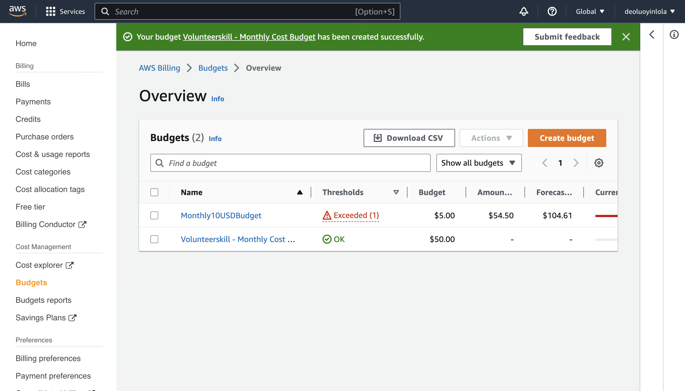

!Note that all the files, images and architecture reference are find inside IAM-permission dir of Docs dir.;

In this DEMO lesson;
* [Goals](#goals)
* [budget](#budget)
* [billing-alarm](#billing-alarm)

## Goals
I create a budget and billing alarm.

## budget
From AWS management console > type `budget` > click `create budget` > Under Template, choose `Monthly cost budget` and adjust where necessary.

