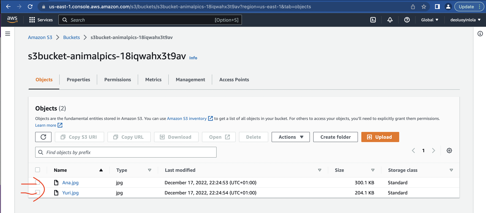

!Note that all the files reference are find inside cfncustom-resources dir of Docs dir. And the architecture for the project as below;

* [Goals](#goals)
* [Basic S3 bucket](#basic-S3-bucket)
* [Working with Custom Resource](#working-with-custom-resource)

## Goals
Learn how custom resources enable you to write custom provisioning logic in templates that AWS CloudFormation runs anytime you create, update (if you changed the custom resource), or delete stacks.

## Basic S3 bucket
- Step 1; Create a basic S3 (basicS3bucket.yaml)
From console, type Cloudformation > Create Stack > Template is ready > Upload a template file > Choose file > (basicS3bucket.yaml) > Next > (Give a name) > Next > Next > Submit.
- Step 3; Open the S3 bucket and Upload;
From S3 bucket stack, click the resource >  Logical ID > Click the icon to open the S3 bucket console > Select the Instance > Upload > Add files > (locate the files to add) > Upload

You can choose to open each images. Now that there is objects inside the bucket, let us try to delete the bucket.
- Step 4; Delete the bucket;
From S3 bucket stack, click the resource >  Delete > Click the icon to 

Alternative to deleting the logical resource, the bucket is to firstly move to the S3 console;
- Selete the particular S3 > Empty > type permanently delete > Exit

- Move back to CloudFormation > Select the stack > Delete > Delete Stack (Without the option)

## Working with Custom Resource
Better alternative to above solution is using custom resource. Which was define inside the customresource.yaml file. 
The key block is the lambda function which provide functionality to our resource. It perform different actions depending on the operation, here to create and delete. Then again define another Type::"Custom::S3Objects" with few properties but the only mandantory property is ServiceToken that tells Cloudformation what back this resource.
While the I AM Role give lambda function the permission to interact with the bucket.
- Step 1; Create a basic S3 (customresource.yaml)
From console, type Cloudformation > Create Stack > Template is ready > Upload a template file > Choose file > (customresource.yaml) > Next > (Give a name) > Next > Next > (This time you need to acknowledge, because of I AM Role) Submit.

You will observe that things were created sequantially.

- Step 2; Check the log group for the lambda
From console, type CloudWatch > Hover (Log) > Log group > click the log > Log stream (click the log)

Each info line contains details of the lambda function as rightly define in the yaml file configuration.

We can go further to upload more images into this bucket.
- Step 3; Delete the bucket;
From Cloudformation stack, select the right stack >  Delete > Delete stack

It will start deleting from reverse dependency order, starting deleting with first logical resource create. Can check the progress from the log event of cloudwatch console.

Voila! the end of exploring cfn custom resource