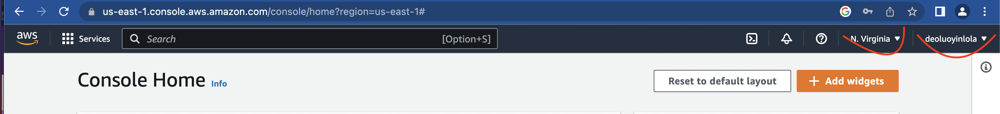
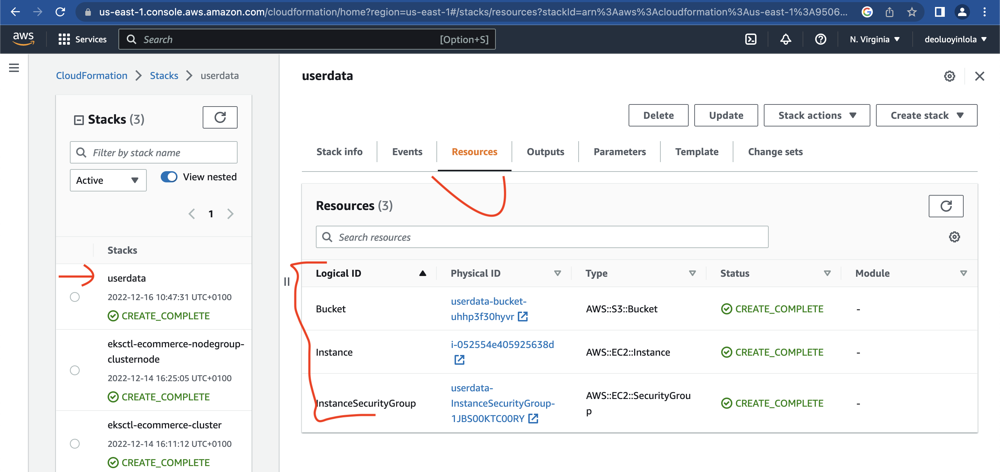
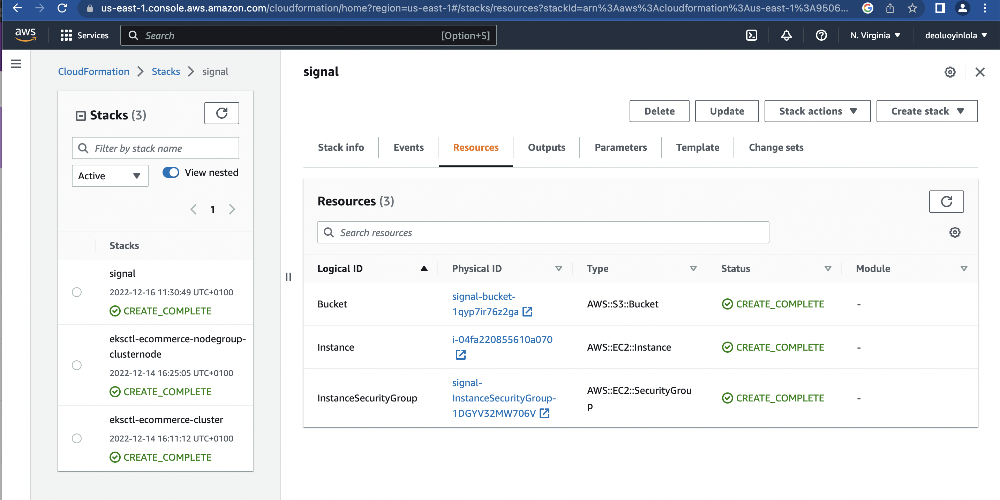
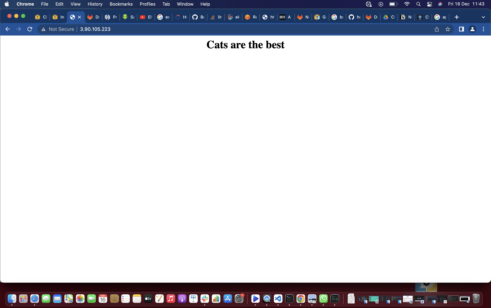

This demo steps through a four step CloudFormation template evolution;
* [Goals](#goals)
* [Userdata](#userdata)
* [Userdata + cfn-signal](#userdata-+-cfn-signal)
* [cfn-init + cfn-signal](#cfn-init-+-cfn-signal)
* [cfn-init + cfn-signal + cfn-hup](#cfn-init-+-cfn-signal-+-cfn-hup)

!Note that all the files reference are find inside cfnsignal-cfninit-cfnhub dir of Docs dir.

## Goals
- Understand CreationPolicy
- Understand How Boostrapping Process Works
- 

## Userdata
- Step 1; Login into AWS account as IAM User and specify us-east-1 as region.

- Step 2; Apply the 1_userdata.yaml in the CloudFormation from console;
From console, type Cloudformation > Create Stack > Template is ready > Upload a template file > Choose file > (1_userdata.yaml) > Next > (Give a name) > Next > Next > Submit. After some minutes, it should create similar resources as below

- Step 3; Open the IP address;
From userdata stack, click the resource > Instance logical ID > Click the icon to open the instance console > Select the Instance > Copy Public IPv4 Address > Open in the new tab. 
Surprised that it doesn't open. Yeah, there is boostrapping processing going on the instance. Should open after 300 seconds(check the userdata section of the config file).
- Step 4; Delete the stack;
From the stack, Delete > Delete stack
- Limitation here is that cloudformation not aware of any boostrapping which is not great and Userdata only apply once, it wouldn't effect any changes even after edit and update. So let examine next option.

## Userdata + cfn-signal
I have made two changes to the new config; (1.) CreationPolicy and (2.) From the Userdata block, I have include a signal, to inform when everything is successful. So the instance will wait for all to set, by this time instance will have finish the boostrap process, before it change status to create_complete.
- Step 1; Apply the 2_userdata.yaml in the CloudFormation from console;
From console, type Cloudformation > Create Stack(with new resources) > Template is ready > Upload a template file > Choose file > (1_userdata with signal.yaml) > Next > (Give a name) > Next > Next > Submit.
This will take some couple of minutes than the first one.

- Step 2; Open the IP address;
From signal stack, click the resource > Instance logical ID > Click the icon to open the instance console > Select the Instance > From Network, copy Public IPv4 Address > Open in the new tab.

- Step 3; Delete the stack;
From the stack, Delete > Delete stack
- Limitation here is, again Userdata only apply once, it wouldn't still effect any changes even after edit and update. So let explore next option.