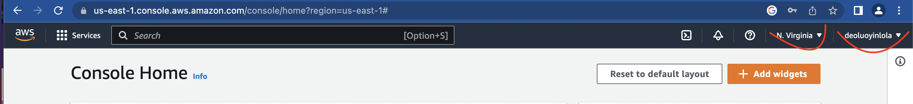
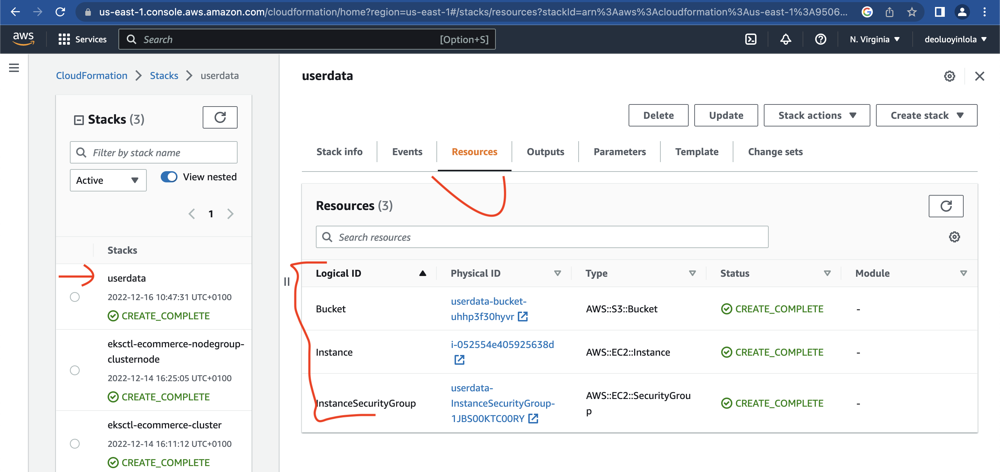
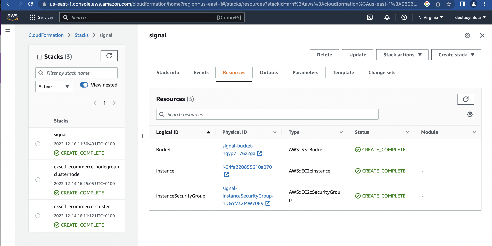
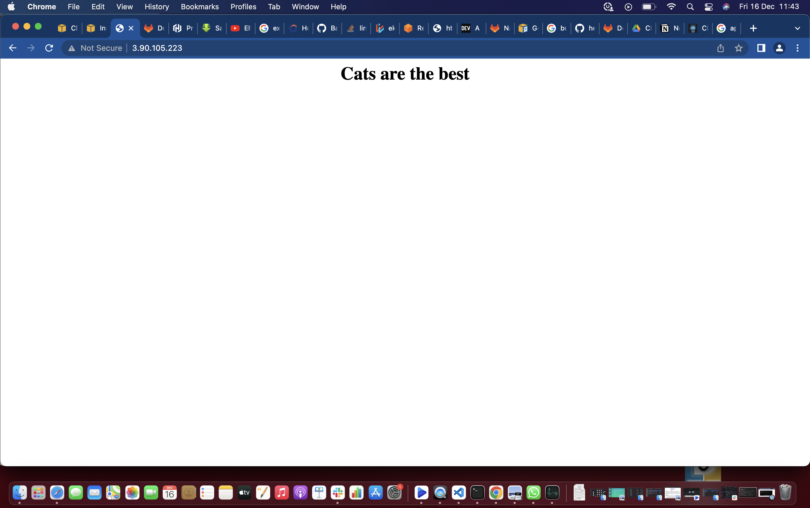
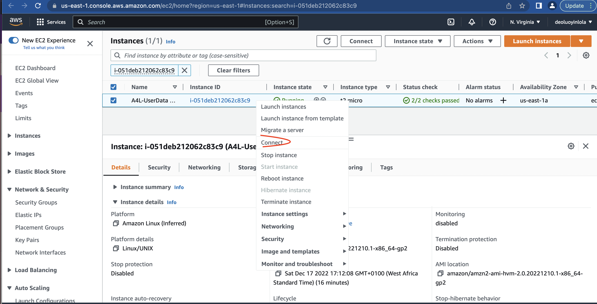
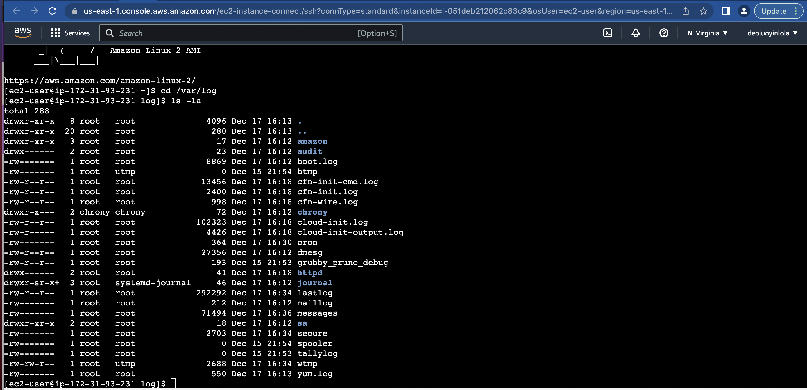
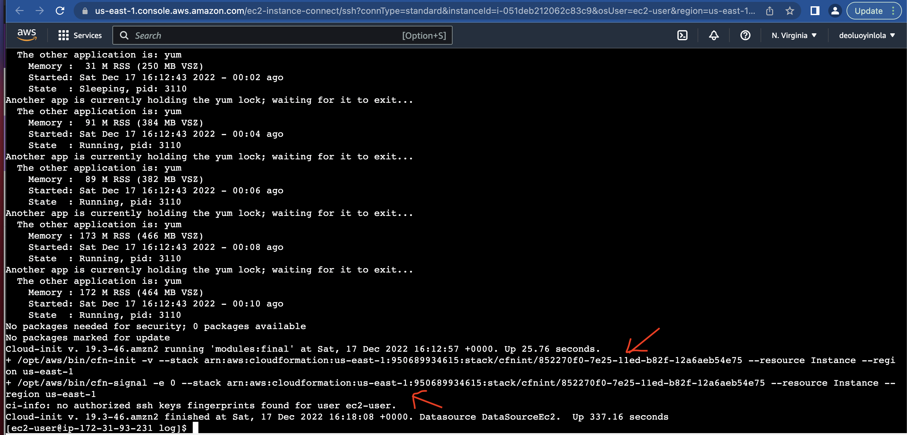
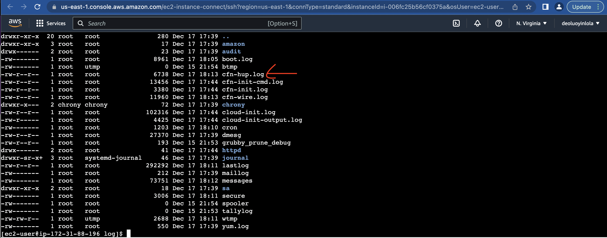
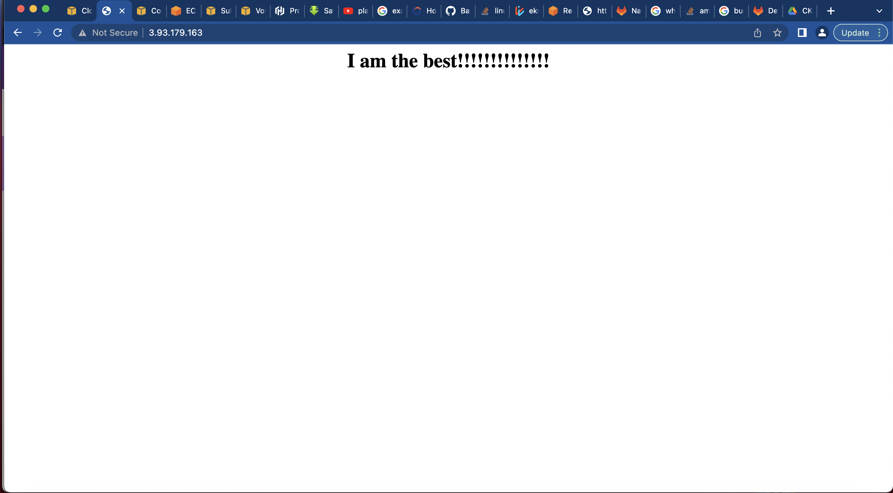

This demo steps through a four step CloudFormation template evolution;
* [Goals](#goals)
* [Userdata](#userdata)
* [Userdata with cfn-signal](#userdata-with-cfn-signal)
* [cfn-init with cfn-signal](#cfn-init-with-cfn-signal)
* [cfn-init with cfn-signal and cfn-hup](#cfn-init-with-cfn-signal-and-cfn-hup)

!Note that all the files reference are find inside cfnsignal-cfninit-cfnhub dir of Docs dir.

## Goals
- Understand CreationPolicy
- Understand How Boostrapping Process Works

## Userdata
- Step 1; Login into AWS account as IAM User and specify us-east-1 as region.



- Step 2; Apply the 1_userdata.yaml in the CloudFormation from console;
From console, type Cloudformation > Create Stack > Template is ready > Upload a template file > Choose file > (1_userdata.yaml) > Next > (Give a name) > Next > Next > Submit. After some minutes, it should create similar resources as below;



- Step 3; Open the IP address;
From userdata stack, click the resource > Instance logical ID > Click the icon to open the instance console > Select the Instance > Copy Public IPv4 Address > Open in the new tab. 
Surprised that it doesn't open. Yeah, there is boostrapping processing going on the instance. Should open after 300 seconds(check the userdata section of the config file).
- Step 4; Delete the stack;
From the stack, Delete > Delete stack
- Limitation here is that cloudformation not aware of any boostrapping which is not great and Userdata only apply once, it wouldn't effect any changes even after edit and update. So let examine next option.

## Userdata with cfn-signal
I have made two changes to the new config; (1.) CreationPolicy and (2.) From the Userdata block, I have include a signal, to inform when everything is successful. So the instance will wait for all to set, by this time instance will have finish the boostrap process, before it change status to create_complete.
- Step 1; Apply the 2_userdata.yaml in the CloudFormation from console;
From console, type Cloudformation > Create Stack(with new resources) > Template is ready > Upload a template file > Choose file > (1_userdata with signal.yaml) > Next > (Give a name) > Next > Next > Submit.
This will take some couple of minutes than the first one.



- Step 2; Open the IP address;
From signal stack, click the resource > Instance logical ID > Click the icon to open the instance console > Select the Instance > From Network, copy Public IPv4 Address > Open in the new tab.



- Step 3; Delete the stack;
From the stack, Delete > Delete stack
- Limitation here is, again Userdata only apply once, it wouldn't still effect any changes even after edit and update. So let explore next option.

## cfn-init with cfn-signal
- Using the cfinit feature inside the metadata block of instance resource. This is an alternative way of configuring instance, cfnint defined will be use at the userdata block.
- Step 1; Apply the 3_cfnint with signal.yaml in the CloudFormation from console;
From console, type Cloudformation > Create Stack(with new resources) > Template is ready > Upload a template file > Choose file > (3_cfnint with signal.yaml) > Next > (Give a name) > Next > Next > Submit.
This will take some couple of minutes than the first one.
- Step 2; Connect to the instance to diagonise it.
From signal stack, click the resource > Instance logical ID > Click the icon to open the instance console > Right click the Instance > Choose connect > EC2 Instance Connect > Click Connect



- Step 3; Check and list the log inside the instance;
```
cd /var/log
ls -la
```


We can then output, view the content of each file with command cat;
```
sudo cat cloud-init-output.log
```
You will see those command we use at the boostrapping processing here;



- Step 3; Delete the stack;
From the stack, Delete > Delete stack

- Limitation here is that it wouldn't update the configuration of the instance if we do update stack and change our parameter values. Let have a look at the last option.

## cfn-init with cfn-signal and cfn-hup
- Here, we will be using cfn-hup utility to detect changes for the metadata resources. If you check the new config file , there is a congfiuration for cfn-hup in the file, specifying the stack, region and interval of how often it should check for the changes and in the second configuration we define what should happen when an update occurs.
- Step 1; Apply the 2_userdata.yaml in the CloudFormation from console;
From console, type Cloudformation > Create Stack(with new resources) > Template is ready > Upload a template file > Choose file > (4_cfninit with cfnsignal and cfnhup.yaml) > Next > (Give a name) > Next > Next > Submit.
This will take some couple of minutes than the first one.
- Step 2; Connect to the instance to diagonise it.
From signal stack, click the resource > Instance logical ID > Click the icon to open the instance console > Right click the Instance > Choose connect > EC2 Instance Connect > Click Connect
The different here, is that cfnhup is configured in addition to the previous settings.
- Step 3; Check and list the log inside the instance;
```
cd /var/log
ls -la
```


We can then output, view the content of this cfnhup file with command cat;
```
sudo cat cfn-hup.log
```
- Step 4; Update the stack; Trying to check the effect of this cfnhup utility by updating the stack from the cloudformation.
From console, select the Stack > Update > Use current template > Change the message (I am the best!!!!!!) > Next > Next > Submit.
So, cfnhup detect this change and re-run cfninit.



- Step 5; Delete the stack;
From the stack, Delete > Delete stack

Voila! the end of exploring userdata, cfn signal, cfninit and cfnhup