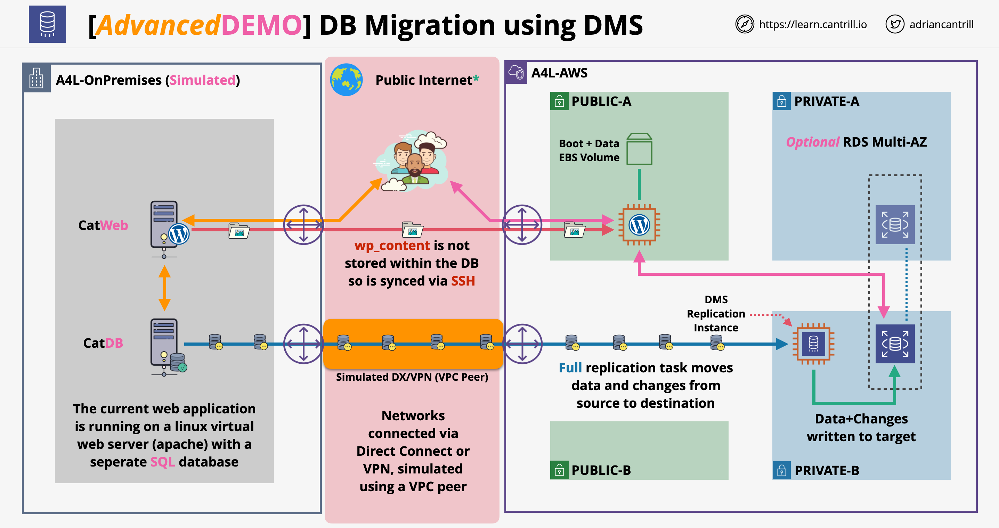
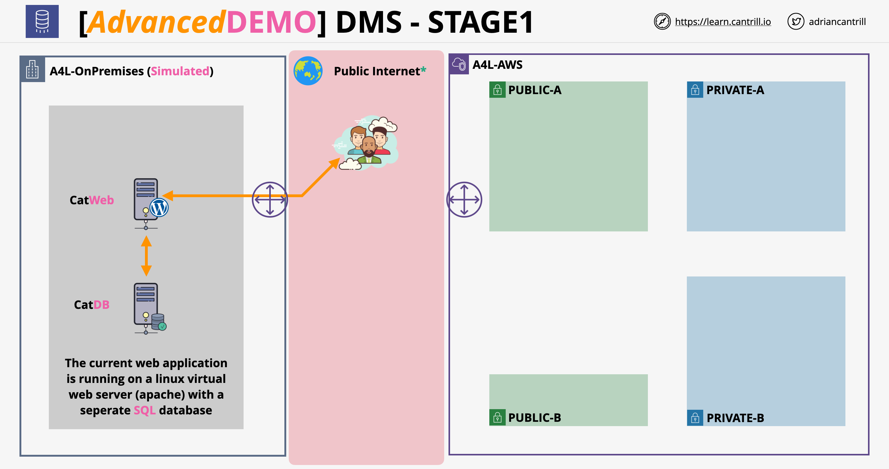
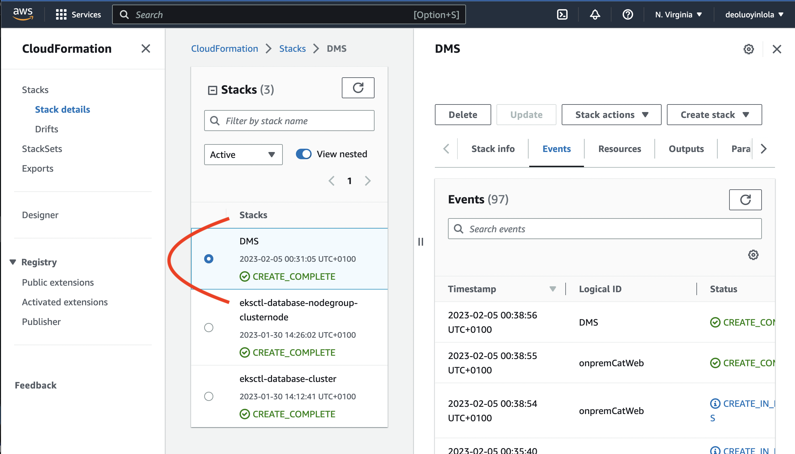
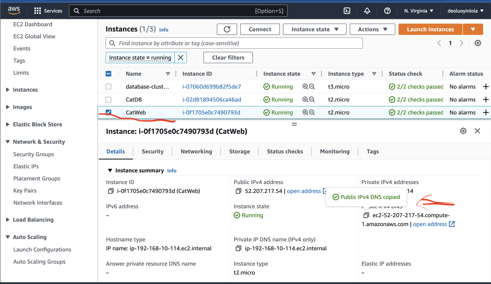
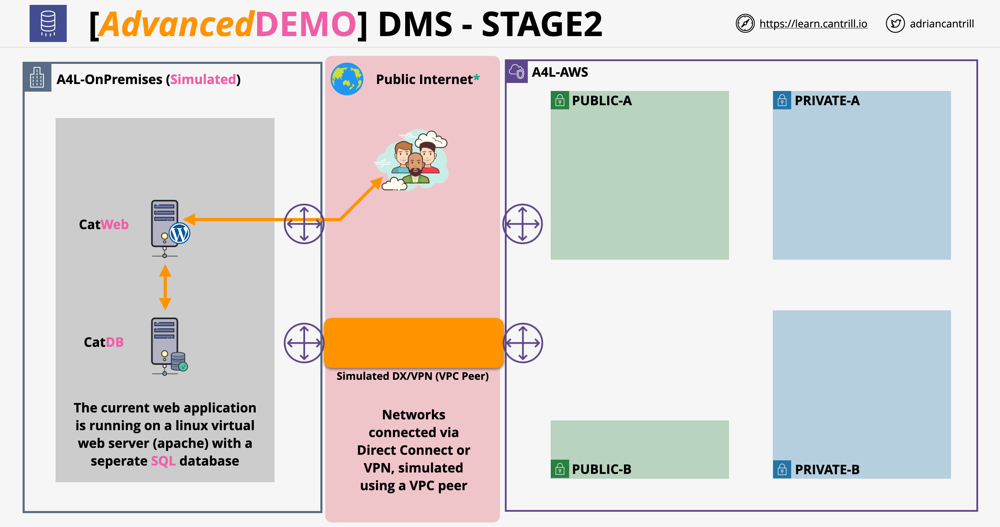
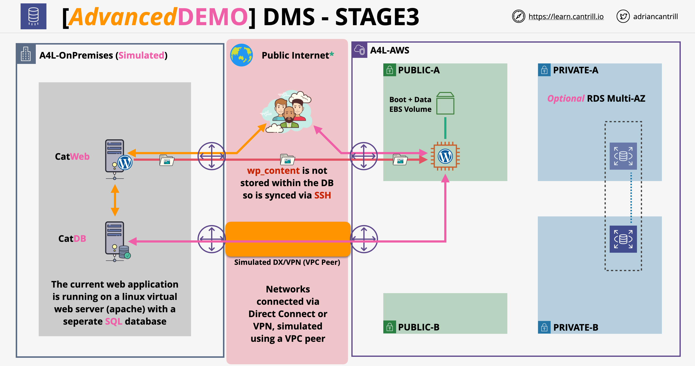
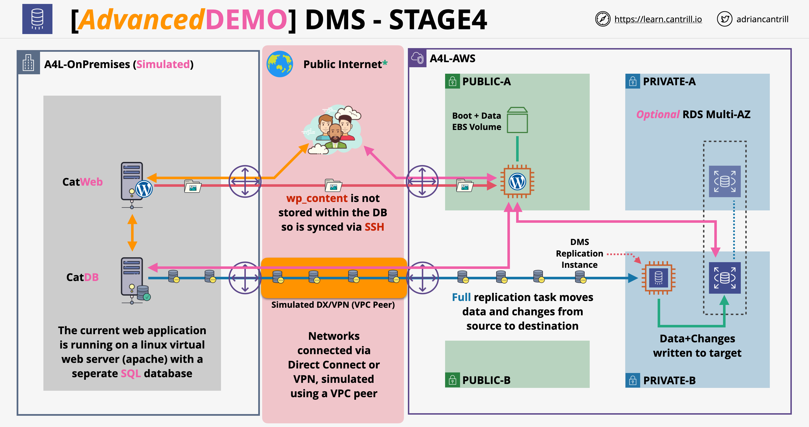

## Description
A demo where I migrated a simple web application (wordpress) from an on-premises environment into AWS. The on-premises environment is a virtual web server (simulated using EC2) and a self-managed mariaDB database server (also simulated via EC2). I have section this project into 4 steps and is replicas of Adrian Cantrill serverless project, [Original project link](https://github.com/acantril/learn-cantrill-io-labs)

* [Pre-requisites](#pre-requisities)
* [Provision the environment and review tasks](#Provision-the-environment-and-review-tasks)
* [Establish Private Connectivity Between the environments (VPC Peer)](#stablish-Private-Connectivity-Between-the-environments-(VPC-Peer))
* [Create & Configure the AWS Side infrastructure (App and DB)](#Create-&-Configure-the-AWS-Side-infrastructure-(App-and-DB))
* [Migrate Database & Cutover](#Migrate-Database-&-Cutover)
* [Cleanup the account](#Cleanup-the-account)

## Pre-requisites
- [aws](https://aws.amazon.com/) - cloud platform, offers reliable, scalable, and inexpensive cloud computing services.

## Provision the environment and review tasks

Click https://console.aws.amazon.com/cloudformation/home?region=us-east-1#/stacks/quickcreate?templateURL=https://learn-cantrill-labs.s3.amazonaws.com/aws-dms-database-migration/DMS.yaml&stackName=DMS to apply the base lab infrastructure.

Then take note of the parameter values

DBName
DBPassword
DBRootPassword
DBUser
I will need all of these in later stages.
All defaults should be pre-populated, you just need to scroll to the bottom, check the capabilities box and click `Create Stack`

Once the stack is in the CREATE_COMPLETE status you will have a simulated on-premises environment and an AWS environment. Move to the EC2 console.
Click `Running Instances`
Select the `CatWEB` instance
Copy down its `Public IPv4 DNS` into your clipboard and open it in a new tab.

You should see the `Animals4life Hall of Fame` load... this is running from the simulated on-premises environment using the CatDB mariaDB instance.

## Establish Private Connectivity Between the environments (VPC Peer)

## Create & Configure the AWS Side infrastructure (App and DB)

## Migrate Database & Cutover

## Cleanup the account

