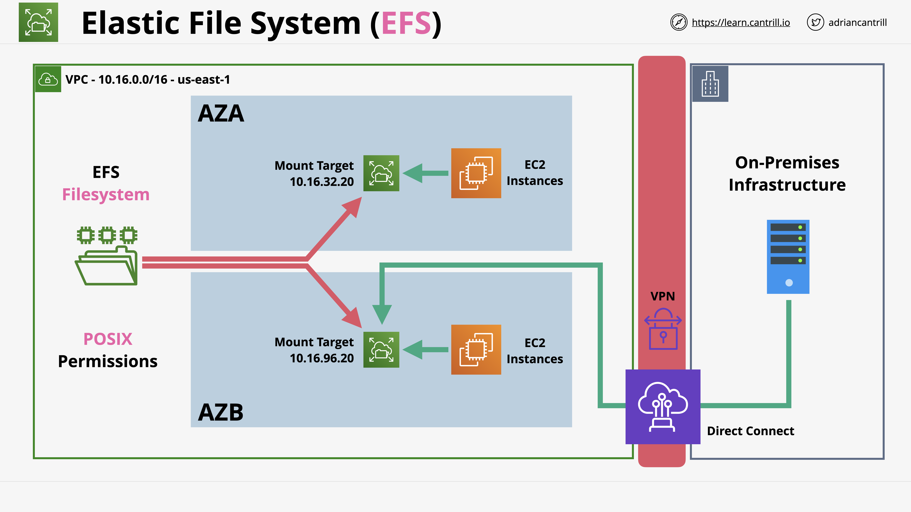

### Note that all the files, images and architecture reference are find inside vpc dir of Docs dir.;

In this DEMO lesson;
* [Goals](#goals)
* [References](#References)
* [EFS](#EFS)

## Goals
In this hands-on I will show how to create EFS in AWS environment.

## References
[AWS-EFS](https://docs.aws.amazon.com/efs/latest/ug/storage-classes.html)

## EFS
- Implemeting Elastic FileSystem; check the elastic-storage directory for the CFN file for easy deployment and make sure creation is completed.
- Mount the EFS into the VPC; move to the EFS console > Click on `Create File System` > Supply a name, choose a VPC, Click on `Customize` for storage, choose `Standard`, for production purpose enable the automatic backup, can also adjust lifecycle management, choose appropriate performance mode(between latency and throughput), enable encrpytion for production purpose > click on `Next`. Next page for Network Access; Network setting, any availability zone within a VPC where one is consuming a service provided by EFS should be creating a mounted target. And setting IP and security group specifically in each AZ. > click on `Next`. For File System policy at least for production purpose should check `Enforce in-transit encryption for all clients` > click on `Next` > Click on `Create`
- Need File System and all mount target ready; select the File System > Click on `Network` > Confirm that `Mount target state` is change to available.
- Configure instance to mount the file system by creating mount folder; Move to EC2 console, select the right instance > right click and choose `Connect` > Choose and click on `EC2 Instance Connect` > click `Connect` > Enter this command at the prompt; `sudo mkdir -p /efs/wp-content` > Next is to install package that allow OS to interact with EFS product by entering the following command; `sudo yum -y install amazon-efs-utils` > Next is to mount this EFS file system in that folder everytime the system restarted; move into etc folder with this command; `cd /etc/` and enter; `sudo nano /etc/fstab` from the nano editor and below the only line, edit with this; `file-system-id:/ /efs/wp-content efs _netdev,tls,iam 0 0`(be sure to replace the file-system-id, get/copy it from the EFS console of the FS). Save and exit the editor. Next is to mount the EFS into the folder just created, with this command; `sudo mount /efs/wp-content`, confirm if it mounted with `df -k`. 
- Confirming the EFS to be network file; from the terminal prompt; from this folder `cd /efs/wp-content` create a file with `sudo touch amazingtestfile.txt` > check if created; `ls -la`. Creating this will actually put it on the network file system, can verify this from other instance(must have perform same above process on the instance)